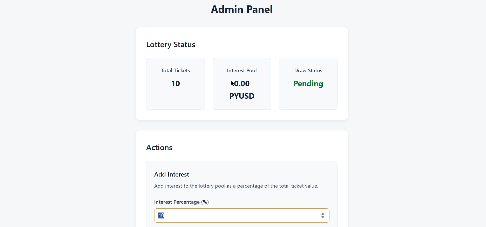
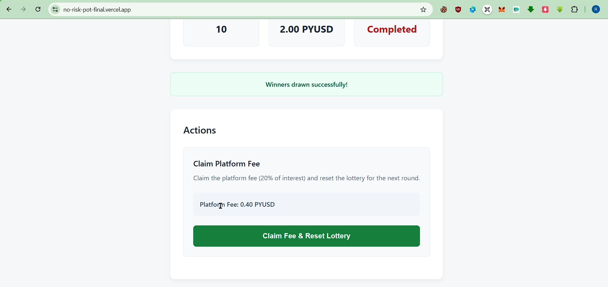

# No Risk Pot
## 🔗 Live Website

Visit the live version here: [https://no-risk-pot-final.vercel.app/](https://no-risk-pot-final.vercel.app/)

Presentation Link [Here](https://drive.google.com/file/d/18ypsebB1qEJnlcXQunI3V5tO5rs4JzAw/view?usp=drive_link)
## Project Overview

No Risk Pot is a revolutionary DeFi lottery platform where users can participate in lottery draws without risking their principal investment. Here's how it works:

1. Users purchase lottery tickets using PYUSD (a stablecoin).
2. The platform admin collects all ticket purchases and invests the pooled funds in liquidity pools or yield farming strategies to generate interest.
3. When a lottery draw occurs, winners are selected and prizes are distributed from the interest earned, not from the principal amount.
4. **Key differentiator:** All users receive their initial investment back, regardless of whether they win or lose the lottery.

### Prize Distribution

- 1st Prize: 50% of the total interest earned
- 2nd Prize: 30% of the total interest earned
- Platform Fee: 20% of the total interest earned goes to the platform owner

This creates a no-loss lottery system where participants can enjoy the excitement of potentially winning while preserving their capital.

## 🖼️ Project Screenshots

### 🏠 Home Page

**Home Page - View 1**  


**Home Page - View 2**  


**Home Page - View 3**  


### 🎟️ Buy Ticket Page

**Buy Ticket - Step 1**  


**Buy Ticket - Step 2**  


### 🛠️ Admin Dashboard

**Admin Page - view-1**  


**Admin Page - view-2**  


**Admin Page - view-3**  


**Admin Page - view-4**  


### 💰 Claim Fund Page

**Claim Fund Page**  


## Project Structure

```
no_risk_pot_v1/
├── contracts/           # Smart contracts written in Solidity
├── scripts/             # Deployment and other utility scripts
├── test/                # Contract test files
├── frontend/            # React-based frontend application
│   ├── public/          # Static files
│   └── src/             # React components and logic
├── hardhat.config.js    # Hardhat configuration
└── package.json         # Project dependencies and scripts
```

## Setup and Installation

### Prerequisites

- Node.js (v16 or higher)
- npm or yarn
- MetaMask or another Web3 wallet
- Access to PYUSD

## Required APIs and Credentials

The project requires the following external services and credentials:

1. **Ethereum RPC URL**: For connecting to the Sepolia testnet

   - You can use Infura, Alchemy, or Google's Blockchain Node Engine
   - Add this to your `.env` file as `SEPOLIA_RPC_URL`

2. **Private Key**: Your Ethereum wallet private key
   - Export from MetaMask (use a development account, not your main wallet)
   - Add this to your `.env` file as `PRIVATE_KEY`
   - CAUTION: Never share your private key or commit it to version control

### Installation Steps

1. Clone the repository

```bash
git clone https://github.com/rahul-rathore786/No_Risk_Pot.git
cd No_Risk_Pot
```

2. Install dependencies for the main project (smart contracts)

```bash
npm install
```

3. Install dependencies for the frontend

```bash
cd frontend
npm install
cd ..
```

4. Create a `.env` file in the root directory with the following variables:

```
PRIVATE_KEY=your_wallet_private_key
SEPOLIA_RPC_URL=your_sepolia_rpc_url
```

## Running the Project

### Deploying Smart Contracts

1. Compile the contracts

```bash
npx hardhat compile
```

2. Deploy to a test network (e.g., Sepolia)

```bash
npx hardhat run scripts/deploy.js --network sepolia
```

### Running the Frontend

1. Start the development server

```bash
cd frontend
npm start
```

2. The application will be available at `http://localhost:3000`


## Security Considerations

- Always ensure your `.env` files are included in `.gitignore`
- Never commit sensitive keys or secrets to version control
- Use a dedicated development wallet with limited funds for testing
- Consider using a hardware wallet for production deployments

## License

This project is licensed under the MIT License - see the LICENSE file for details.
